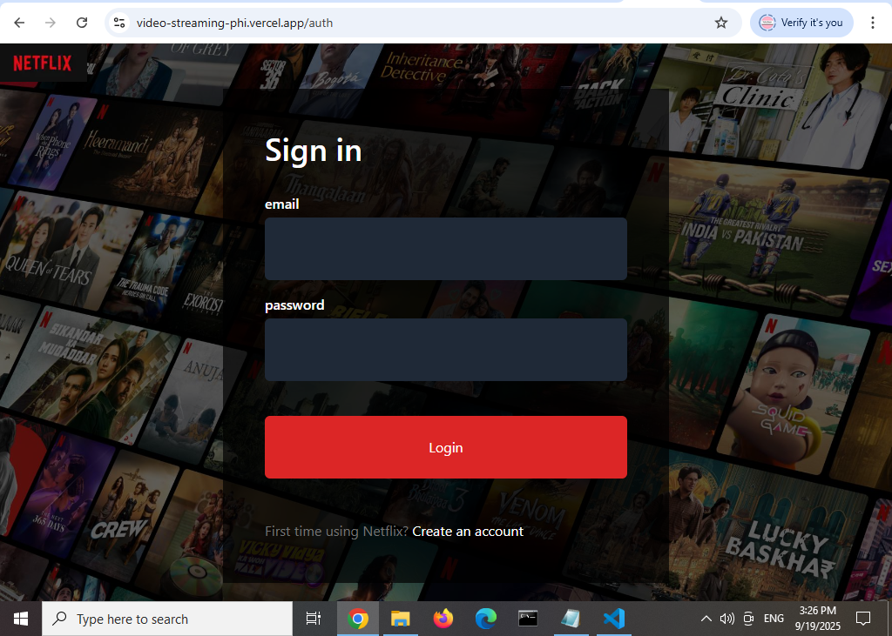
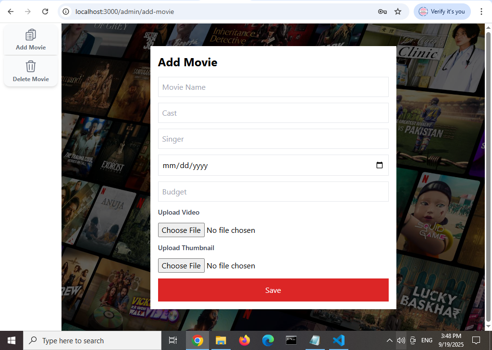
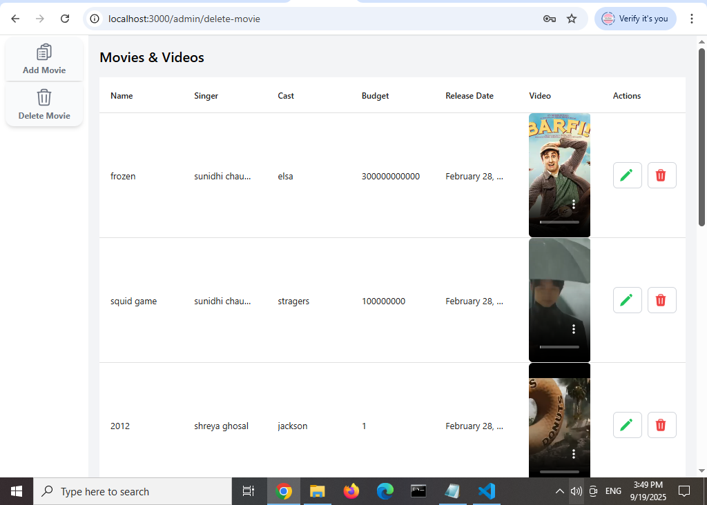
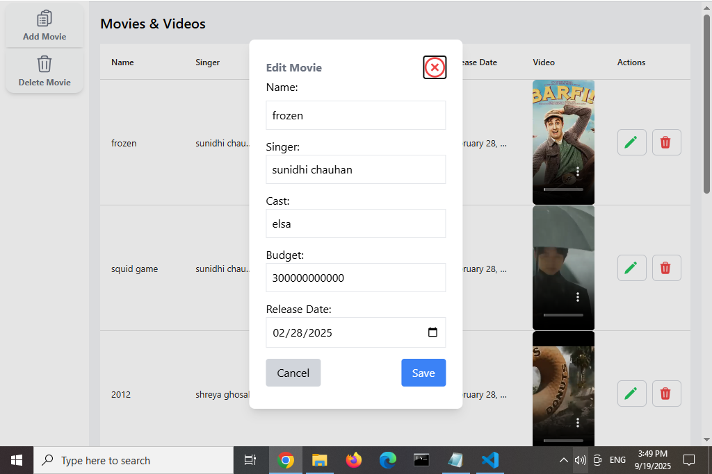

# 🎬 Video-streaming app

A responsive and fully-functional Netflix clone built with modern web technologies. Users can browse, view, and stream movies and TV shows with a sleek UI inspired by Netflix.

## 🌐 Live Demo

👉 [Visit the live app here](https://video-streaming-phi.vercel.app/)

## Screenshots
### 1. Home Page 
  

### 2. Login Page
  

### 3. Register Page


### 4. Add Movie Page
  

### 5. Delete Movie Page
  

### 6. Edit Movie Page
  

## Getting Started

First, run the development server:

```bash
npm run dev
# or
yarn dev
# or
pnpm dev
# or
bun dev
```


api routes
https://video-streaming-phi.vercel.app/admin/auth  - for signup and login
https://video-streaming-phi.vercel.app/admin/add-movie        - to add movies
https://video-streaming-phi.vercel.app/admin/delete-movie        -to manage movies (to update and delete movies)


